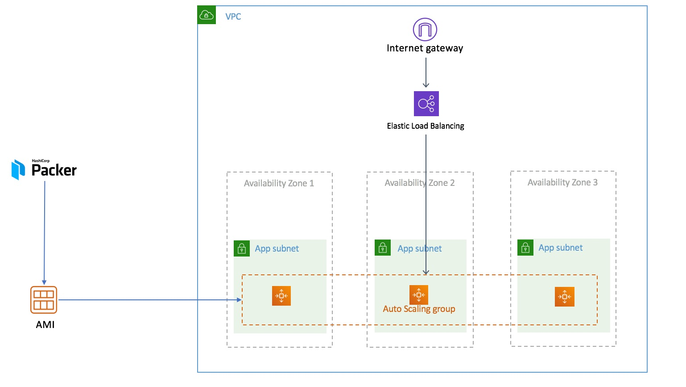

# 2.createLB-ASG-HK




如图示架构，我们需要2个步骤：

1：使用Packer制作AMI

目录内的文件说明

| 文件                                       | 描述                                                         |
| ------------------------------------------ | ------------------------------------------------------------ |
| amaz2-stress-hk.json和amaz2-stress-nx.json | 这两个文件分别是香港和中国宁夏两个region内的AMI定义的描述文件，用于Packer创建文件 |
| base_install.sh                            | 这个文件是会在json文件里面定义和被调用的脚本。               |
| burnCPU.sh和index.php                      | 是压缩包burn.tgz里面的文件内容。                             |
| burn.tgz                                   | 是压缩包，里面包含了burnCPU.sh 和index.php                   |

由于默认AWS China不能访问80、443，需要额外开通，所以我们以HK做实验。


首先查看Packer制作镜像的描述文件：

```shell
{
  "builders": [
    {
      "type": "amazon-ebs",
      "access_key": "Your-AWS-Account-AK",
      "secret_key": "Your-AWS-Account-SK",
      "region": "ap-east-1",
      "source_ami": "ami-570c7726",
      "instance_type": "c5.large",
      "ssh_username": "ec2-user",
      "ami_name": "amaz2-stress {{timestamp}} by packer"
    }
  ],
  "provisioners": [
    {
      "type": "file",
      "source": "burn.tgz",
      "destination": "/tmp/burn.tgz"
    },
    {
      "type": "shell",
      "script": "base_install.sh"
    }
  ]
}
```

主要说明如下：

builders和provisioners是代表了packer打包ami的最终要的三部分。还有一个Post-Processors，当前环境没有用到。


builders:

| 代码     | 解释                                                         |
| -------- | ------------------------------------------------------------ |
| builders | 这部分是看后端接入的类型，比如：AWS/Azure/Google Cloud       |
| Type     | 这个amazon-ebs是在后端为AWS的其中一种打包方法，也是我们最常见的，启动一个实例，进行修改，然后关机，创建AMI。除此之外，还有另外4种模式：chroot/EBS Surrogate/EBS Volume/Instance 总计5种的修改方法。可以去读文档查看具体的参数: : https://packer.io/docs/builders/amazon-ebs.html |
| AK/SK    | AWS AK/SK                                                    |

provisioners:

| 代码        | 解释                                                         |
| ----------- | ------------------------------------------------------------ |
| Type        | 主要类型有集成ansible/shell/file/Powershell/Chef.. 等总计10几种的模式。 |
| source      | 本地文件存放位置                                             |
| destination | 文件上传目标路径                                             |

当前这个语法file 代表将本地一个压缩文件传入到镜像的/tmp/下面，Shell这个部分代表，后续执行本地这个base_install.sh的脚本。


<!--特别说明：-->

<!--由于创建AMI属于一个临时行为，所以packer这个命令在简化环境下，需要default vpc, 否则会报错。而通常生产环境里面，defalut vpc已经删除。而用生产环境里面的vpc, 需要制定更多参数。-->


我们需要进入当前ami-packer目录，执行命令打包：

```shell
[ec2-user@ip-172-31-22-159 ami-maker]$ packer  build amaz2-stree-hk.json 
amazon-ebs output will be in this color.

==> amazon-ebs: Prevalidating AMI Name: amaz2-stress 1566530942 by packer
    amazon-ebs: Found Image ID: ami-570c7726
==> amazon-ebs: Creating temporary keypair: packer_5d5f5d7e-21ca-5f6c-62c1-14517a092628
==> amazon-ebs: Creating temporary security group for this instance: packer_5d5f5d83-63fc-bffe-8049-b616426fcc26
==> amazon-ebs: Authorizing access to port 22 from [0.0.0.0/0] in the temporary security groups...
==> amazon-ebs: Launching a source AWS instance...
==> amazon-ebs: Adding tags to source instance
    amazon-ebs: Adding tag: "Name": "Packer Builder"
    amazon-ebs: Instance ID: i-0eb31ca09c65dfbbb
==> amazon-ebs: Waiting for instance (i-0eb31ca09c65dfbbb) to become ready...
==> amazon-ebs: Using ssh communicator to connect: 18.163.6.72
==> amazon-ebs: Waiting for SSH to become available...
==> amazon-ebs: Connected to SSH!
==> amazon-ebs: Uploading burn.tgz => /tmp/burn.tgz
burn.tgz 890 B / 890 B [===========================================================================================================================================] 100.00% 0s
==> amazon-ebs: Provisioning with shell script: base_install.sh
    amazon-ebs: Loaded plugins: extras_suggestions, langpacks, priorities, update-motd
    amazon-ebs: Resolving Dependencies
==> amazon-ebs: There are unfinished transactions remaining. You might consider running yum-complete-transaction, or "yum-complete-transaction --cleanup-only" and "yum history redo last", first to finish them. If those don't work you'll have to try removing/installing packages by hand (maybe package-cleanup can help).
    amazon-ebs: --> Running transaction check
    amazon-ebs: ---> Package httpd.x86_64 0:2.4.39-1.amzn2.0.1 will be installed
    amazon-ebs: --> Processing Dependency: httpd-tools = 2.4.39-1.amzn2.0.1 for package: httpd-2.4.39-1.amzn2.0.1.x86_64
    amazon-ebs: --> Processing Dependency: httpd-filesystem = 2.4.39-1.amzn2.0.1 for package: httpd-2.4.39-1.amzn2.0.1.x86_64
    amazon-ebs: --> Processing Dependency: system-logos-httpd for package: httpd-2.4.39-1.amzn2.0.1.x86_64
    amazon-ebs: --> Processing Dependency: mod_http2 for package: httpd-2.4.39-1.amzn2.0.1.x86_64
    amazon-ebs: --> Processing Dependency: httpd-filesystem for package: httpd-2.4.39-1.amzn2.0.1.x86_64
    amazon-ebs: --> Processing Dependency: /etc/mime.types for package: httpd-2.4.39-1.amzn2.0.1.x86_64
    amazon-ebs: --> Processing Dependency: libaprutil-1.so.0()(64bit) for package: httpd-2.4.39-1.amzn2.0.1.x86_64
    amazon-ebs: --> Processing Dependency: libapr-1.so.0()(64bit) for package: httpd-2.4.39-1.amzn2.0.1.x86_64
    amazon-ebs: ---> Package php.x86_64 0:5.4.16-45.amzn2.0.6 will be installed
    amazon-ebs: --> Processing Dependency: php-cli(x86-64) = 5.4.16-45.amzn2.0.6 for package: php-5.4.16-45.amzn2.0.6.x86_64
    amazon-ebs: --> Processing Dependency: php-common(x86-64) = 5.4.16-45.amzn2.0.6 for package: php-5.4.16-45.amzn2.0.6.x86_64
    amazon-ebs: --> Running transaction check
    amazon-ebs: ---> Package apr.x86_64 0:1.6.3-5.amzn2.0.2 will be installed
    amazon-ebs: ---> Package apr-util.x86_64 0:1.6.1-5.amzn2.0.2 will be installed
    amazon-ebs: --> Processing Dependency: apr-util-bdb(x86-64) = 1.6.1-5.amzn2.0.2 for package: apr-util-1.6.1-5.amzn2.0.2.x86_64
    amazon-ebs: ---> Package generic-logos-httpd.noarch 0:18.0.0-4.amzn2 will be installed
    amazon-ebs: ---> Package httpd-filesystem.noarch 0:2.4.39-1.amzn2.0.1 will be installed
    amazon-ebs: ---> Package httpd-tools.x86_64 0:2.4.39-1.amzn2.0.1 will be installed
    amazon-ebs: ---> Package mailcap.noarch 0:2.1.41-2.amzn2 will be installed
    amazon-ebs: ---> Package mod_http2.x86_64 0:1.15.1-1.amzn2 will be installed
    amazon-ebs: ---> Package php-cli.x86_64 0:5.4.16-45.amzn2.0.6 will be installed
    amazon-ebs: ---> Package php-common.x86_64 0:5.4.16-45.amzn2.0.6 will be installed
    amazon-ebs: --> Processing Dependency: libzip.so.2()(64bit) for package: php-common-5.4.16-45.amzn2.0.6.x86_64
    amazon-ebs: --> Running transaction check
    amazon-ebs: ---> Package apr-util-bdb.x86_64 0:1.6.1-5.amzn2.0.2 will be installed
    amazon-ebs: ---> Package libzip010-compat.x86_64 0:0.10.1-9.amzn2.0.5 will be installed
    amazon-ebs: --> Finished Dependency Resolution
    amazon-ebs:
    amazon-ebs: Dependencies Resolved
    amazon-ebs:
    amazon-ebs: ================================================================================
    amazon-ebs:  Package                Arch      Version                   Repository     Size
    amazon-ebs: ================================================================================
    amazon-ebs: Installing:
    amazon-ebs:  httpd                  x86_64    2.4.39-1.amzn2.0.1        amzn2-core    1.3 M
    amazon-ebs:  php                    x86_64    5.4.16-45.amzn2.0.6       amzn2-core    1.4 M
    amazon-ebs: Installing for dependencies:
    amazon-ebs:  apr                    x86_64    1.6.3-5.amzn2.0.2         amzn2-core    118 k
    amazon-ebs:  apr-util               x86_64    1.6.1-5.amzn2.0.2         amzn2-core     99 k
    amazon-ebs:  apr-util-bdb           x86_64    1.6.1-5.amzn2.0.2         amzn2-core     19 k
    amazon-ebs:  generic-logos-httpd    noarch    18.0.0-4.amzn2            amzn2-core     19 k
    amazon-ebs:  httpd-filesystem       noarch    2.4.39-1.amzn2.0.1        amzn2-core     23 k
    amazon-ebs:  httpd-tools            x86_64    2.4.39-1.amzn2.0.1        amzn2-core     87 k
    amazon-ebs:  libzip010-compat       x86_64    0.10.1-9.amzn2.0.5        amzn2-core     30 k
    amazon-ebs:  mailcap                noarch    2.1.41-2.amzn2            amzn2-core     31 k
    amazon-ebs:  mod_http2              x86_64    1.15.1-1.amzn2            amzn2-core    147 k
    amazon-ebs:  php-cli                x86_64    5.4.16-45.amzn2.0.6       amzn2-core    2.9 M
    amazon-ebs:  php-common             x86_64    5.4.16-45.amzn2.0.6       amzn2-core    566 k
    amazon-ebs:
    amazon-ebs: Transaction Summary
    amazon-ebs: ================================================================================
    amazon-ebs: Install  2 Packages (+11 Dependent packages)
    amazon-ebs:
    amazon-ebs: Total download size: 6.7 M
    amazon-ebs: Installed size: 22 M
    amazon-ebs: Downloading packages:
    amazon-ebs: --------------------------------------------------------------------------------
    amazon-ebs: Total                                               18 MB/s | 6.7 MB  00:00
    amazon-ebs: Running transaction check
    amazon-ebs: Running transaction test
    amazon-ebs: Transaction test succeeded
    amazon-ebs: Running transaction
==> amazon-ebs: ** Found 2 pre-existing rpmdb problem(s), 'yum check' output follows:
==> amazon-ebs: 32:bind-license-9.9.4-74.amzn2.1.2.noarch is a duplicate with 32:bind-license-9.9.4-73.amzn2.1.2.noarch
==> amazon-ebs: python-libs-2.7.16-2.amzn2.0.1.x86_64 is a duplicate with python-libs-2.7.14-58.amzn2.0.4.x86_64
    amazon-ebs:   Installing : apr-1.6.3-5.amzn2.0.2.x86_64                                1/13
    amazon-ebs:   Installing : apr-util-bdb-1.6.1-5.amzn2.0.2.x86_64                       2/13
    amazon-ebs:   Installing : apr-util-1.6.1-5.amzn2.0.2.x86_64                           3/13
    amazon-ebs:   Installing : httpd-tools-2.4.39-1.amzn2.0.1.x86_64                       4/13
    amazon-ebs:   Installing : generic-logos-httpd-18.0.0-4.amzn2.noarch                   5/13
    amazon-ebs:   Installing : mailcap-2.1.41-2.amzn2.noarch                               6/13
    amazon-ebs:   Installing : httpd-filesystem-2.4.39-1.amzn2.0.1.noarch                  7/13
    amazon-ebs:   Installing : mod_http2-1.15.1-1.amzn2.x86_64                             8/13
    amazon-ebs:   Installing : httpd-2.4.39-1.amzn2.0.1.x86_64                             9/13
    amazon-ebs:   Installing : libzip010-compat-0.10.1-9.amzn2.0.5.x86_64                 10/13
    amazon-ebs:   Installing : php-common-5.4.16-45.amzn2.0.6.x86_64                      11/13
    amazon-ebs:   Installing : php-cli-5.4.16-45.amzn2.0.6.x86_64                         12/13
    amazon-ebs:   Installing : php-5.4.16-45.amzn2.0.6.x86_64                             13/13
    amazon-ebs:   Verifying  : apr-util-1.6.1-5.amzn2.0.2.x86_64                           1/13
    amazon-ebs:   Verifying  : libzip010-compat-0.10.1-9.amzn2.0.5.x86_64                  2/13
    amazon-ebs:   Verifying  : php-cli-5.4.16-45.amzn2.0.6.x86_64                          3/13
    amazon-ebs:   Verifying  : apr-util-bdb-1.6.1-5.amzn2.0.2.x86_64                       4/13
    amazon-ebs:   Verifying  : httpd-tools-2.4.39-1.amzn2.0.1.x86_64                       5/13
    amazon-ebs:   Verifying  : httpd-2.4.39-1.amzn2.0.1.x86_64                             6/13
    amazon-ebs:   Verifying  : httpd-filesystem-2.4.39-1.amzn2.0.1.noarch                  7/13
    amazon-ebs:   Verifying  : php-5.4.16-45.amzn2.0.6.x86_64                              8/13
    amazon-ebs:   Verifying  : mod_http2-1.15.1-1.amzn2.x86_64                             9/13
    amazon-ebs:   Verifying  : apr-1.6.3-5.amzn2.0.2.x86_64                               10/13
    amazon-ebs:   Verifying  : mailcap-2.1.41-2.amzn2.noarch                              11/13
    amazon-ebs:   Verifying  : generic-logos-httpd-18.0.0-4.amzn2.noarch                  12/13
    amazon-ebs:   Verifying  : php-common-5.4.16-45.amzn2.0.6.x86_64                      13/13
    amazon-ebs:
    amazon-ebs: Installed:
    amazon-ebs:   httpd.x86_64 0:2.4.39-1.amzn2.0.1       php.x86_64 0:5.4.16-45.amzn2.0.6
    amazon-ebs:
    amazon-ebs: Dependency Installed:
    amazon-ebs:   apr.x86_64 0:1.6.3-5.amzn2.0.2
    amazon-ebs:   apr-util.x86_64 0:1.6.1-5.amzn2.0.2
    amazon-ebs:   apr-util-bdb.x86_64 0:1.6.1-5.amzn2.0.2
    amazon-ebs:   generic-logos-httpd.noarch 0:18.0.0-4.amzn2
    amazon-ebs:   httpd-filesystem.noarch 0:2.4.39-1.amzn2.0.1
    amazon-ebs:   httpd-tools.x86_64 0:2.4.39-1.amzn2.0.1
    amazon-ebs:   libzip010-compat.x86_64 0:0.10.1-9.amzn2.0.5
    amazon-ebs:   mailcap.noarch 0:2.1.41-2.amzn2
    amazon-ebs:   mod_http2.x86_64 0:1.15.1-1.amzn2
    amazon-ebs:   php-cli.x86_64 0:5.4.16-45.amzn2.0.6
    amazon-ebs:   php-common.x86_64 0:5.4.16-45.amzn2.0.6
    amazon-ebs:
    amazon-ebs: Complete!
    amazon-ebs: Loaded plugins: extras_suggestions, langpacks, priorities, update-motd
==> amazon-ebs: Existing lock /var/run/yum.pid: another copy is running as pid 2748.
==> amazon-ebs: Another app is currently holding the yum lock; waiting for it to exit...
==> amazon-ebs:   The other application is: yum
==> amazon-ebs:     Memory :  42 M RSS (332 MB VSZ)
==> amazon-ebs:     Started: Fri Aug 23 03:29:45 2019 - 00:01 ago
==> amazon-ebs:     State  : Sleeping, pid: 2748
==> amazon-ebs: Another app is currently holding the yum lock; waiting for it to exit...
==> amazon-ebs:   The other application is: yum
==> amazon-ebs:     Memory : 101 M RSS (392 MB VSZ)
==> amazon-ebs:     Started: Fri Aug 23 03:29:45 2019 - 00:03 ago
==> amazon-ebs:     State  : Running, pid: 2748
    amazon-ebs: Cleaning repos: amzn2-core amzn2extra-docker amzn2extra-epel
    amazon-ebs: 13 metadata files removed
    amazon-ebs: 6 sqlite files removed
    amazon-ebs: 0 metadata files removed
    amazon-ebs: Loaded plugins: extras_suggestions, langpacks, priorities, update-motd
    amazon-ebs: Resolving Dependencies
==> amazon-ebs: There are unfinished transactions remaining. You might consider running yum-complete-transaction, or "yum-complete-transaction --cleanup-only" and "yum history redo last", first to finish them. If those don't work you'll have to try removing/installing packages by hand (maybe package-cleanup can help).
    amazon-ebs: --> Running transaction check
    amazon-ebs: ---> Package epel-release.noarch 0:7-11 will be installed
    amazon-ebs: --> Finished Dependency Resolution
    amazon-ebs:
    amazon-ebs: Dependencies Resolved
    amazon-ebs:
    amazon-ebs: ================================================================================
    amazon-ebs:  Package              Arch           Version      Repository               Size
    amazon-ebs: ================================================================================
    amazon-ebs: Installing:
    amazon-ebs:  epel-release         noarch         7-11         amzn2extra-epel          15 k
    amazon-ebs:
    amazon-ebs: Transaction Summary
    amazon-ebs: ================================================================================
    amazon-ebs: Install  1 Package
    amazon-ebs:
    amazon-ebs: Total download size: 15 k
    amazon-ebs: Installed size: 24 k
    amazon-ebs: Downloading packages:
    amazon-ebs: Running transaction check
    amazon-ebs: Running transaction test
    amazon-ebs: Transaction test succeeded
    amazon-ebs: Running transaction
    amazon-ebs:   Installing : epel-release-7-11.noarch                                     1/1
    amazon-ebs:   Verifying  : epel-release-7-11.noarch                                     1/1
    amazon-ebs:
    amazon-ebs: Installed:
    amazon-ebs:   epel-release.noarch 0:7-11
    amazon-ebs:
    amazon-ebs: Complete!
    amazon-ebs: Installing epel-release
    amazon-ebs:   0  ansible2                 available    [ =2.4.2  =2.4.6 ]
    amazon-ebs:   2  httpd_modules            available    [ =1.0 ]
    amazon-ebs:   3  memcached1.5             available    [ =1.5.1  =1.5.16 ]
    amazon-ebs:   4  nginx1.12                available    [ =1.12.2 ]
    amazon-ebs:   5  postgresql9.6            available    [ =9.6.6  =9.6.8 ]
    amazon-ebs:   6  postgresql10             available    [ =10 ]
    amazon-ebs:   8  redis4.0                 available    [ =4.0.5  =4.0.10 ]
    amazon-ebs:   9  R3.4                     available    [ =3.4.3 ]
    amazon-ebs:  10  rust1                    available    \
    amazon-ebs:         [ =1.22.1  =1.26.0  =1.26.1  =1.27.2  =1.31.0 ]
    amazon-ebs:  11  vim                      available    [ =8.0 ]
    amazon-ebs:  13  ruby2.4                  available    [ =2.4.2  =2.4.4 ]
    amazon-ebs:  15  php7.2                   available    \
    amazon-ebs:         [ =7.2.0  =7.2.4  =7.2.5  =7.2.8  =7.2.11  =7.2.13  =7.2.14
    amazon-ebs:           =7.2.16  =7.2.17  =7.2.19 ]
    amazon-ebs:  16  php7.1                   available    \
    amazon-ebs:         [ =7.1.22  =7.1.25  =7.1.27  =7.1.28  =7.1.30 ]
    amazon-ebs:  17  lamp-mariadb10.2-php7.2  available    \
    amazon-ebs:         [ =10.2.10_7.2.0  =10.2.10_7.2.4  =10.2.10_7.2.5
    amazon-ebs:           =10.2.10_7.2.8  =10.2.10_7.2.11  =10.2.10_7.2.13
    amazon-ebs:           =10.2.10_7.2.14  =10.2.10_7.2.16  =10.2.10_7.2.17
    amazon-ebs:           =10.2.10_7.2.19 ]
    amazon-ebs:  18  libreoffice              available    [ =5.0.6.2_15  =5.3.6.1 ]
    amazon-ebs:  19  gimp                     available    [ =2.8.22 ]
    amazon-ebs:  20  docker=latest            enabled      \
    amazon-ebs:         [ =17.12.1  =18.03.1  =18.06.1 ]
    amazon-ebs:  21  mate-desktop1.x          available    [ =1.19.0  =1.20.0 ]
    amazon-ebs:  22  GraphicsMagick1.3        available    [ =1.3.29  =1.3.32 ]
    amazon-ebs:  23  tomcat8.5                available    \
    amazon-ebs:         [ =8.5.31  =8.5.32  =8.5.38  =8.5.40  =8.5.42 ]
    amazon-ebs:  24  epel=latest              enabled      [ =7.11 ]
    amazon-ebs:  25  testing                  available    [ =1.0 ]
    amazon-ebs:  26  ecs                      available    [ =stable ]
    amazon-ebs:  27  corretto8                available    \
    amazon-ebs:         [ =1.8.0_192  =1.8.0_202  =1.8.0_212  =1.8.0_222 ]
    amazon-ebs:  28  firecracker              available    [ =0.11 ]
    amazon-ebs:  29  golang1.11               available    [ =1.11.3  =1.11.11 ]
    amazon-ebs:  30  squid4                   available    [ =4 ]
    amazon-ebs:  31  php7.3                   available    \
    amazon-ebs:         [ =7.3.2  =7.3.3  =7.3.4  =7.3.6 ]
    amazon-ebs:  32  lustre2.10               available    [ =2.10.5 ]
    amazon-ebs:  33  java-openjdk11           available    [ =11 ]
    amazon-ebs:  34  lynis                    available    [ =stable ]
    amazon-ebs:  35  kernel-ng                available    [ =stable ]
    amazon-ebs:  36  BCC                      available    [ =0.x ]
    amazon-ebs:  37  mono                     available    [ =5.x ]
    amazon-ebs: Loaded plugins: extras_suggestions, langpacks, priorities, update-motd
==> amazon-ebs: https://mirrors.sonic.net/epel/7/x86_64/repodata/repomd.xml: [Errno -1] repomd.xml does not match metalink for epel
==> amazon-ebs: Trying other mirror.
==> amazon-ebs: https://ewr.edge.kernel.org/fedora-buffet/epel/7/x86_64/repodata/d748a548825eb7ebeca7c8cb8e98387afe904e7bc00dab7c9c35795379cc183d-primary.sqlite.bz2: [Errno 14] HTTPS Error 404 - Not Found
==> amazon-ebs: Trying other mirror.
    amazon-ebs: 191 packages excluded due to repository priority protections
    amazon-ebs: Resolving Dependencies
==> amazon-ebs: There are unfinished transactions remaining. You might consider running yum-complete-transaction, or "yum-complete-transaction --cleanup-only" and "yum history redo last", first to finish them. If those don't work you'll have to try removing/installing packages by hand (maybe package-cleanup can help).
    amazon-ebs: --> Running transaction check
    amazon-ebs: ---> Package stress.x86_64 0:1.0.4-16.el7 will be installed
    amazon-ebs: --> Finished Dependency Resolution
    amazon-ebs:
    amazon-ebs: Dependencies Resolved
    amazon-ebs:
    amazon-ebs: ================================================================================
    amazon-ebs:  Package          Arch             Version                 Repository      Size
    amazon-ebs: ================================================================================
    amazon-ebs: Installing:
    amazon-ebs:  stress           x86_64           1.0.4-16.el7            epel            39 k
    amazon-ebs:
    amazon-ebs: Transaction Summary
    amazon-ebs: ================================================================================
    amazon-ebs: Install  1 Package
    amazon-ebs:
    amazon-ebs: Total download size: 39 k
    amazon-ebs: Installed size: 94 k
    amazon-ebs: Downloading packages:
==> amazon-ebs: warning: /var/cache/yum/x86_64/2/epel/packages/stress-1.0.4-16.el7.x86_64.rpm: Header V3 RSA/SHA256 Signature, key ID 352c64e5: NOKEY
    amazon-ebs: Public key for stress-1.0.4-16.el7.x86_64.rpm is not installed
    amazon-ebs: Retrieving key from file:///etc/pki/rpm-gpg/RPM-GPG-KEY-EPEL-7
==> amazon-ebs: Importing GPG key 0x352C64E5:
==> amazon-ebs:  Userid     : "Fedora EPEL (7) <epel@fedoraproject.org>"
==> amazon-ebs:  Fingerprint: 91e9 7d7c 4a5e 96f1 7f3e 888f 6a2f aea2 352c 64e5
==> amazon-ebs:  Package    : epel-release-7-11.noarch (@amzn2extra-epel)
==> amazon-ebs:  From       : /etc/pki/rpm-gpg/RPM-GPG-KEY-EPEL-7
    amazon-ebs: Running transaction check
    amazon-ebs: Running transaction test
    amazon-ebs: Transaction test succeeded
    amazon-ebs: Running transaction
    amazon-ebs:   Installing : stress-1.0.4-16.el7.x86_64                                   1/1
    amazon-ebs:   Verifying  : stress-1.0.4-16.el7.x86_64                                   1/1
    amazon-ebs:
    amazon-ebs: Installed:
    amazon-ebs:   stress.x86_64 0:1.0.4-16.el7
    amazon-ebs:
    amazon-ebs: Complete!
==> amazon-ebs: Created symlink from /etc/systemd/system/multi-user.target.wants/httpd.service to /usr/lib/systemd/system/httpd.service.
    amazon-ebs: burnCPU.sh
    amazon-ebs: index.php
==> amazon-ebs: Stopping the source instance...
    amazon-ebs: Stopping instance
==> amazon-ebs: Waiting for the instance to stop...
==> amazon-ebs: Creating AMI amaz2-stress 1566530942 by packer from instance i-0eb31ca09c65dfbbb
    amazon-ebs: AMI: ami-04262661376a925a7
==> amazon-ebs: Waiting for AMI to become ready...
==> amazon-ebs: Terminating the source AWS instance...
==> amazon-ebs: Cleaning up any extra volumes...
==> amazon-ebs: No volumes to clean up, skipping
==> amazon-ebs: Deleting temporary security group...
==> amazon-ebs: Deleting temporary keypair...
Build 'amazon-ebs' finished.

==> Builds finished. The artifacts of successful builds are:
--> amazon-ebs: AMIs were created:
ap-east-1: ami-04262661376a925a7
```

请看最后一行： ami-04262661376a925a7


后面我们将这个作为变量，提供后面的terraform执行，LB+ASG的创建。


2: 创建LB + ASG


查看main.tf文件,  修改参数值。

```shell
##
provider "aws" {
  region = "ap-east-1"         \\ 替换成您实际操作的Region
  access_key = "Your-AWS-AK"    \\ 替换您自己账号的AK
  secret_key = "Your-AWS-SK"     \\ 替换成你自己账号的SK 
}
##
variable "asg_instances_id" {
  default     = "From_Packer_create_AMI_ID"   \\ 替换成你上面从Packer获取到的AMI ID
}
###
data "aws_vpc" "default" {
  default = true
}
data "aws_subnet_ids" "all" {
  vpc_id = data.aws_vpc.default.id
}
data "aws_security_group" "default" {
  vpc_id = data.aws_vpc.default.id
  name   = "default"
}
data "aws_ami" "amazon_linux" {
  most_recent = true
  owners = ["amazon"]
  filter {
    name = "name"
    values = [
      "amzn-ami-hvm-*-x86_64-gp2",
    ]
  }
  filter {
    name = "owner-alias"

    values = [
      "amazon",
    ]
  }
}


####
module "elb" {
  source = "../terraform-modules/terraform-aws-elb/"

  name = "elb-example"

  subnets         = data.aws_subnet_ids.all.ids
  security_groups = [data.aws_security_group.default.id]
  internal        = false

  listener = [
    {
      instance_port     = "80"
      instance_protocol = "HTTP"
      lb_port           = "80"
      lb_protocol       = "HTTP"
    },
  ]

  health_check = {
      target              = "HTTP:80/"
      interval            = 30
      healthy_threshold   = 2
      unhealthy_threshold = 2
      timeout             = 5
    }

  tags = {
    Owner       = "user"
    Environment = "dev"
  }

}


####

module "example_asg" {
  source = "../my-modules/terraform-aws-autoscaling/"

  name = "example-with-lb-asg"

  # Launch configuration
  #
  # launch_configuration = "my-existing-launch-configuration" # Use the existing launch configuration
  # create_lc = false # disables creation of launch configuration
  lc_name = "example-lc"

  image_id        = "${var.asg_instances_id}"
  instance_type   = "c5.large"
  security_groups = [data.aws_security_group.default.id]
  load_balancers  = [module.elb.this_elb_id]
  key_name 	  = "hongkong"

  # Auto-scaling policies and CloudWatch metric alarms
  autoscaling_policies_enabled           = "true"
  cpu_utilization_high_threshold_percent = "70"
  cpu_utilization_low_threshold_percent  = "20"

  root_block_device = [
    {
      volume_size = "10"
      volume_type = "gp2"
    },
  ]

  # Auto scaling group
  asg_name                  = "example-asg"
  vpc_zone_identifier       = data.aws_subnet_ids.all.ids
  health_check_type         = "EC2"
  min_size                  = 1
  max_size                  = 3
  desired_capacity          = 1
  wait_for_capacity_timeout = 0

  tags = [
    {
      key                 = "Environment"
      value               = "dev"
      propagate_at_launch = true
    },
    {
      key                 = "Project"
      value               = "megasecret"
      propagate_at_launch = true
    },
  ]
}
```


其他参数按照我们上一个LAB的方法获取参数含义，并自行调整。


执行命令：

$  terraform init

$  terrrform plan

$  terraform apply  -auto-approve


## 检验结果：

执行成功后，默认只会在ASG创建1台主机，找到LB的DNS Name，进行访问：

例如： https://elb-example-291281982.ap-east-1.elb.amazonaws.com


同时结合AWS Console观察EC2的create 和 terminal，也可以通过ASG查看：

