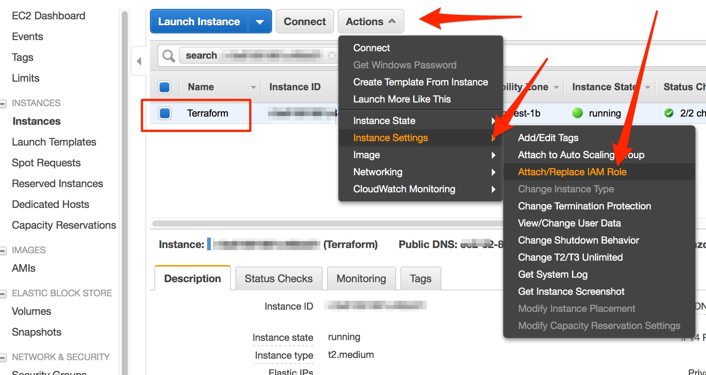

# Terraform的典型应用场景

Terraform是一个可以支持多种云环境，进行创建，更改和版本控制的工具。是一个云上进行基础架构构建的Infra-As-Code的最佳工具，我们应用它，可以实现多种创建的构建。这里主要介绍一些典型场景的实现。


相信大家已经知道Terraform的基本使用方式了。在我们以后的场景中，主要讨论一些实用架构的实现。在实际使用中，Terraform在多云基础架构构建中，是非常方便和简洁的。Terraform造了足够多的轮子，使用起来非常顺手。但是一旦在云上的基础构建完成后，想构建一些复杂系统，基于OS之上时，就需要交给Ansible和PowerShell来进行实现了。例如创建K8S的集群环境，在创建这些复杂架构的方法上，存在多种工具，但是我们需要企业级产品的时候，就需要更高的控制精细程度。


首先说明一下我们当前是以AWS为例实现的，当前我们用的也是AWS最佳实践中的Mutli-Account的设计。采用Role的方式进行控制和连接的。当然具体案例里面如果需要AK/SK，会单独说明的。


这里是一个典型的AWS多账号设计，左边的是Operation运维组用户的人员的核心账号下的运维主机Terraform，这台主机上同时集成安装了ansible和packer工具，用于实现后面的实验，但是实际生产环境中可能会依据性能分拆，当前实验环境中，都是单机实现即可。由图可知，我们通过对于右边受管理的账号Project or Team的项目账号进行管理。例如：初始化账号，包括创建组网VPC/Subnet/Role/Tags、创建IAM、安全组等一系列的动作。完成这个账号的初始化动作。


为了顺利完成后面的场景实现，您需要以下前提依赖。


## 前提依赖：

1：我们当前的操作都在宁夏的Region，纯粹为了省钱。后面我们使用到别的Region,会独立说明。

2：2个账号，左边的账号是运维账号，里面创建一台可以访问公网的VM，建议使用Amazon Linux 2。 右边账号是一个空账号，有内容也没有关系。我们会新建立VPC进行环境组件。不影响现有使用。

具体方法：

我假设你不管用什么方式，已经建立了Amazon Linux 2在你的环境里面了。随便你在哪个Subnet，我也不管，只要能出公网访问。

使用以下命令，进行环境依赖的安装。

$ sudo amazon-linux-extras install epel -y

$ sudo yum install -y ansible 

$ sudo curl -o /tmp/terraform.zip  https://releases.hashicorp.com/terraform/0.12.10/terraform_0.12.10_linux_amd64.zip

$ sudo curl -o /tmp/packer.zip https://releases.hashicorp.com/packer/1.4.4/packer_1.4.4_linux_amd64.zip

$ sudo unzip /tmp/terraform.zip -d /usr/local/bin

$ sudo unzip /tmp/packer.zip -d /usr/local/bin

或者使用本目录中的setup.sh

$ bash setup.sh

3：添加IAM权限。

- 我们先去在右侧是受管账号（Project or Team Account）下面去建立Assume Role，具体如图：

  IAM->Roles->Create Role


这里的Role关联了Policy AdministratorAccess, 仅用于测试。但是实际生产上，要依据实际实际用户来进行权限划分。


这一步创建Tags, 啥也没有填。你随意。


这里给Role name添加了一个名字”terraform-assume-role“


请查看这个role的ARN，如下图，请记录好，后面我们在Operation Account里面会用到。


- 下面我们在左侧的运维账号（Operation Account）进行Policy/Role的创建。

  首先创建Policy, IAM->Policies->Create Policy

  

  ```json
  {
      "Version": "2012-10-17",
      "Statement": {
          "Effect": "Allow",
          "Action": "sts:AssumeRole",
          "Resource": [
              "arn:aws-cn:iam::123456780001:role/terraform-assume-role"
          ]
      }
  }
  ```
  
  
  
  添加Policy Name: terraform-assume-policy, 后面我们会关联到terraform ec2 role里面。


现在建立Terraform EC2 Role,  请如下操作IAM-> Roles->Create role， 选择AWS Service -> EC2


搜索之前创建的Policy, terraform, 勾选之前创建的Policy


填写role的名字： terraform-ec2-role


选中之前创建的Terraform EC2, 依次执行如图



更新为我们创建的Role: terraform-ec2-role


## 下面是具体一些场景案例：


### 目录:   0.createVPC-BJ-And-NX/

说明：这个目录其实本来不存在的，应要求加入的。这个其实就是简单VPC环境创建方法。创建VPC/Subnet/Route Table/Tags


### 目录:  1.createApp-In-WWW/

说明： 这个目录实现的是一个全球应用架构的部署，在你国际账号里面你指定的每个Region创建一个应用。仅仅是为了演示如果做到全球部署的一种方式。


### 目录：2.createLB-ASG-HK

说明：这个目录实现一个典型的LB + Auto Scaling Group的架构，AMI的创建，是使用Packer实现的。

 

### 目录：3.

说明：中国区一直没有落地EFS，这个场景是一个HA架构的NFS，使用的方案是Pacemaker + DRBD + NFS的，从使用效果来看，其实就是一个高可用的HA。这个是由开源作为解决方案的。实际上RedHat 和 SuSE都可以基于其HA产品，提供商业的解决方案。这里只是代表方案可行性。如果用于商业行为，需要保障，建议采用商业版本进行支持。整体是通过Terraform和Ansible进行集成实现的。


这是方案1：采用OverlayIP,也就是我们目前实现的方式。


下面是HA的架构关系图


实际上还可以使用EIP来实现这个HA功能，目前这个版本的架构不支持。等后续有时间我再改进吧。

